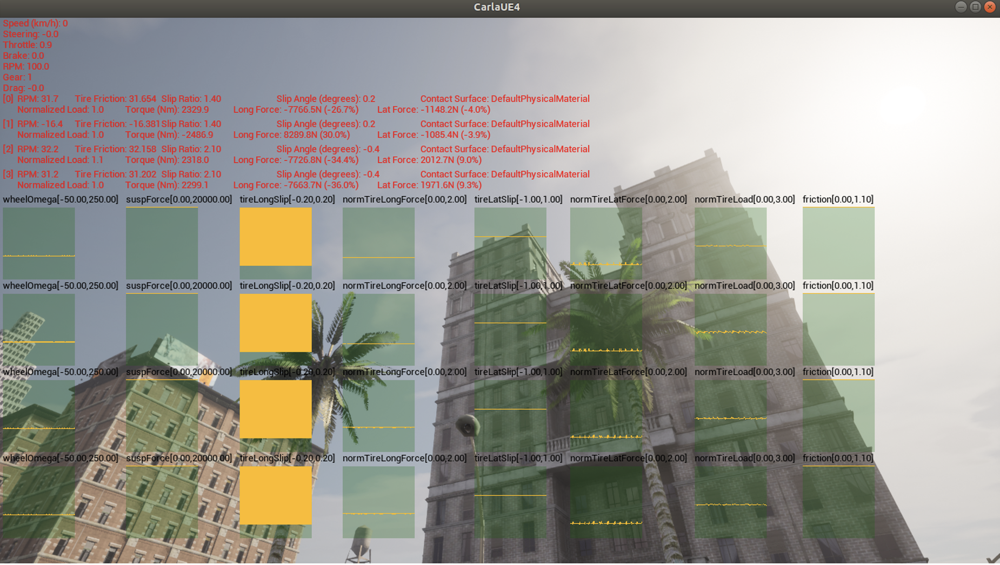
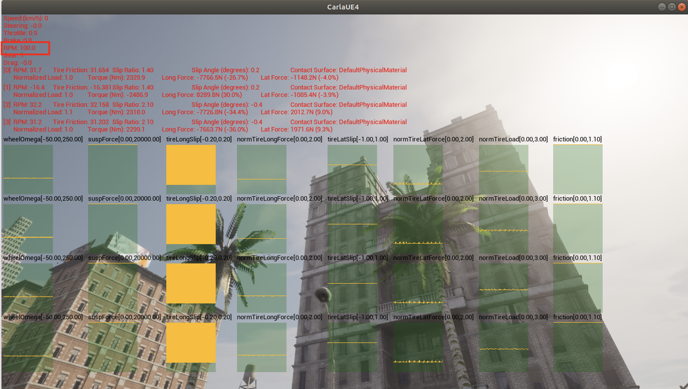
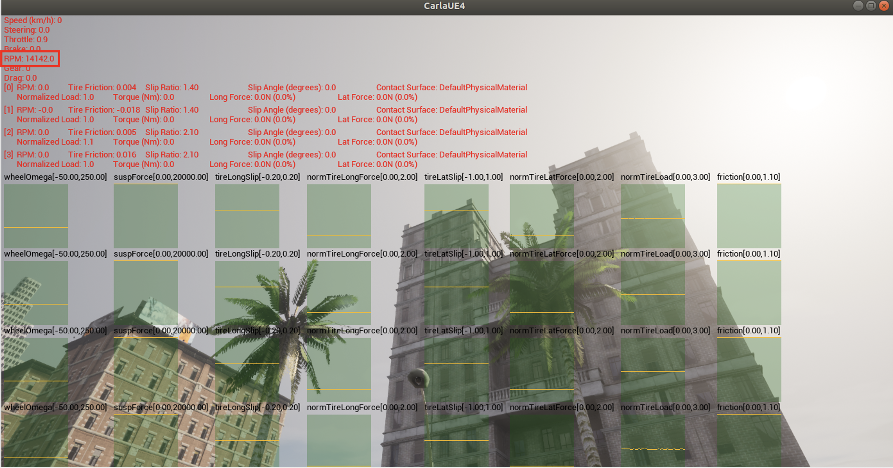

이번 포스팅에서는 Carla Simulator에서 차량의 동역학적 요소 (타이어 마찰력, 엔진 관성 모멘트 등)을 변경하는 방법에 대해 알아보도록 하겠습니다.  

변경한 차량의 동역학적 요소들은 해당 파이썬 스크립트를 실행하는 Runtime에만 적용되며, 종료 후에는 Carla Simulator 내의 차량 기본 값으로 전환됩니다.  

휠의 마찰력, damping, steering을 변경하고, 엔진, 질량, 항력계수 등을 변경했습니다. 

Carla Simulator에서 차량의 토크, RPM, Slip Angle 등의 다양한 차량 동역학 요소를 확인하는 방법으로 `Telemetry` 기능을 제공합니다.  
이는 Carla Simulator의 서버에서 확인 가능합니다.  
`Telemetry` 기능을 사용하기 위해 `show_debug_telemetry(차량)` 메소드를 이용합니다.  

  
위 그림은 Carla Simulator 서버의 `Telemetry` 입니다.
각 바퀴별로 지면과의 마챨력, 수직력 등을 확인할 수 있습니다.  

전체 코드입니다.  

물리량 적용 결과를 위해 `rpm` 변수의 값만 변경해보겠습니다.  
`rpm`은 각각 100, 100,000으로 극단적으로 설정한 후 결과를 비교했습니다.  
먼저 `rpm` 값을 100으로 설정한 후 시뮬레이션을 진행했습니다.  
  
위 그림에서와 같이 RPM 값이 100이 나오는 것을 확인할 수 있습니다.  

두 번째로 `rpm` 값을 100,000으로 설정 후 시뮬레이션을 진행했습니다.  

RPM 값이 14142.0이 나옴을 확인했습니다.  
이렇게 차량의 동역학 요소를 수정하여 손쉽게 주행 성능 평가를 할 수 있을 것으로 예상됩니다.  
  
감사합니다!