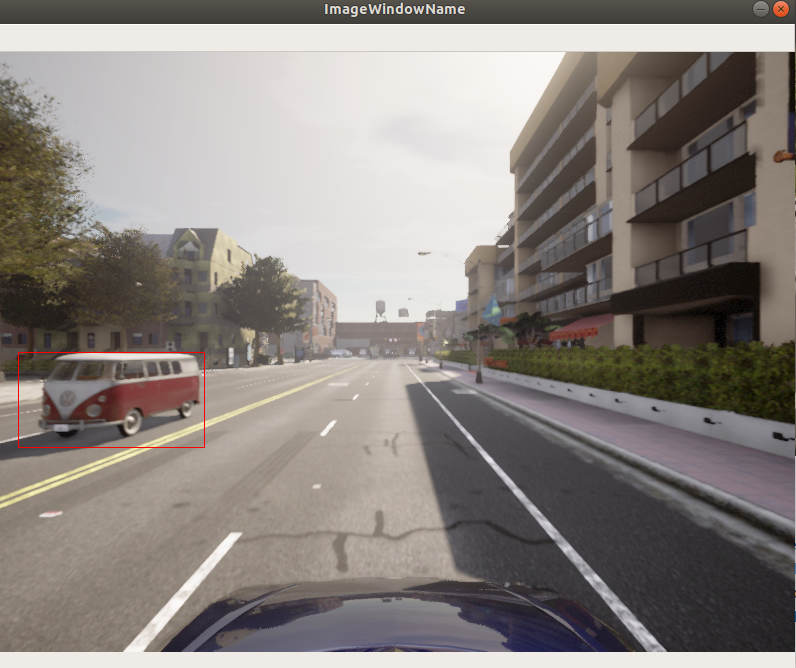
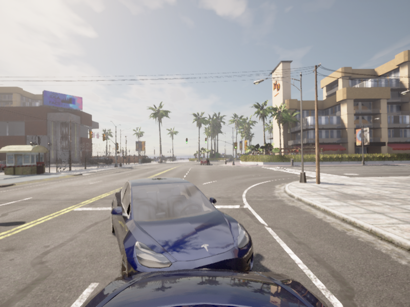
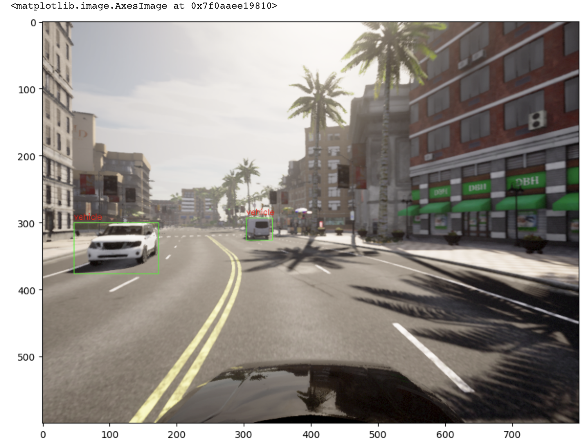

지난 포스트에서는 Carla Simulator 3D Bounding Box 생성에 대한 기본을 알아봤습니다.    
이번 시간에는 2D Bounding Box 및 Pascal VOC 데이터 셋 수집에 대해 포스팅을 진행하도록 하겠습니다.  
먼저 지난 Bounding Box 기본 포스트의 내용 중 일부를 가져오겠습니다.  
## 1. 2D Bounding Box
### 1.1. 기존 코드
기존 코드와 동일하게 사용합니다.  
```python
import os
import glob
import sys
import time

try:
    sys.path.append(glob.glob('carla_simulation_root/PythonAPI/carla/dist/carla-*%d.%d-%s.egg' % (
        sys.version_info.major,
        sys.version_info.minor,
        'win-amd64' if os.name == 'nt' else 'linux-x86_64'))[0])

except IndexError:
    pass

import carla
import argparse
import logging

from numpy import random

import cv2

import numpy as np

import math
import queue
```

이전 포스트와 동일하게 `Client`, 맵, 차량 및 센서들을 배치하도록 하겠습니다.  
```python
# Client 설정
client = carla.Client('localhost', 2000)
client.set_timeout(20.0)

# 맵 설정
world = client.load_world('Town01')
settings = world.get_settings()
settings.fixed_delta_seconds = 0.05
settings.synchronous_mode = True
world.apply_settings(settings)

spawn_points = world.get_map().get_spawn_points()

# 날씨 설정
weather = carla.WeatherParameters(
  cloudiness = 0.0,
  precipitation = 0.0,
  sun_altitude_angle = 110.0
)
world.set_weather(weather)

# 에고 차량 설정
ego_vehicle = None
vehicle_bp = random.choice(world.get_blueprint_library().filter('vehicle'))

vehicle_transform = random.choice(spawn_points)

ego_vehicle = world.spawn_actor(vehicle_bp, vehicle_transform)

ego_vehicle.set_autopilot(True)
actor_list.append(ego_vehicle)

# 카메라 설정
ego_camera = None
camera_bp = world.get_blueprint_library().find('sensor.camera.rgb')
camera_init_trans = carla.Transform(carla.Location(z=2.0))
ego_camera = world.spawn_actor(camera_bp, camera_init_trans, attach_to=ego_vehicle)
actor_list.append(ego_camera)
```

### 1.2. Image Queue
지난 포스팅의 내용을 바탕으로 맵, 차량, 센서 등을 설정했습니다.  
이어서 시뮬레이션을 진행하며 얻는 카메라 데이터를 <b>queue</b> 형식으로 데이터를 받습니다.  
```python
# 카메라 데이터를 저장 및 검색하기 위한 queue 생성
image_q = queue.Queue()
ego_camera.listen(image_q.put)
```
카메라 데이터 취득 시 image의 사이즈, 시야각을 설정해줍니다.  
```python
image_w = camera_bp.get_attribute("image_size_x").as_int()
image_h = camera_bp.get_attribute("image_size_y").as_int()
fov = camera_bp.get_attribute("fov").as_float()
```
또한 아래와 같이 image 사이즈, 시야각을 설정해줄 수 있습니다.  
```python
image_w = camera_bp.get_attribute("image_size_x", str(640))
image_h = camera_bp.get_attribute("image_size_y", str(480))
fov = camera_bp.get_attribute("fov", float(110.0))
```

### 1.3. Image Projection
시뮬레이션을 진행하며 3D 포인트로 이루어진 객체를 2D 평면으로 투영하는 과정을 거쳐야 합니다.  
이러한 과정을 <b>image projection</b>이라 합니다.   

```python
def build_projection_matrix(w, h, fov):
  focal = w / (2.0 * np.tan(fov * np.pi / 360.0))
  K = np.identity(3)
  K[0, 0] = K[1, 1] = focal           # focal length
  K[0, 2] = w / 2.0                   # principal point
  K[1, 2] = h / 2.0                   # principal point
  return K
```
`Focal Length`는 normalized scale에서 pixel scale로 변환 할 수 있도록 해줍니다.  
`Principal point`는 중앙 픽셀의 값입니다. 각각 `K[0, 2]`는 x축, `K[1, 2]`는 y축을 의미합니다.  
`K[2, 2]`의 1은 3차원에서 2차원으로 축소하기 위해서 1로 사용합니다.  

설정한 image 사이즈 및 시야각과 위에서 정의된 함수 `build_projection_matrix(w, h, fov)`를 이용하여 Camera projection matrix를 구하겠습니다.  
```python
K = build_projection_matrix(image_w, image_h, fov)
```

### 1.4. 좌표 변환
위 [Image_Projection](#3-image-projection)에서 구해진 3D 좌표에서 2D 좌표로 변환해야 합니다.  
먼저, `actor.get_transform().get_inverse_matrix()` 메소드를 이용하여 3D 좌표를 카메라 좌표로 변환합니다.    
```python
world_2_camera = np.array(ego_camera.get_transform().get_inverse_matrix())
```

```python
def get_image_point(loc, K, w2c):
  point = np.array([loc.x, loc.y, loc.z, 1])
  point_2d = np.dot(w2c, point)
  point_2d = [point_2d[1], -point_2d[2], point_2d[0]]
  point_img = np.dot(K, point_2d)
  point_img[0] /= point_img[2]
  point_img[1] /= point_img[2]

  return point_img[0:2]
```
- `loc`는 3차원 좌표로 `carla.Position`으로 얻을 수 있습니다.  
- `point`는 `loc`로 얻어진 3차원 좌표를 배열로 나타냈습니다.  
- `point_2d`는 3차원 좌표 배열인 `point`를 카메라 좌표인 2차원 좌표로 변환했습니다.  
또한 (x, y, z) 좌표를 Unreal 엔진의 좌표 (y, -z, x)로 변환해줍니다.  
- `point_img`는 image projection matrix 값과 카메라 좌표로 변환된 행렬간의 곱입니다.  

### 1.5. Bounging Box Set
Carla Simulator에서는 Bounding Box를 사용할 객체 카테고리를 정해줄 수 있습니다.  
`get_level_bbs` attribute를 사용하여 Bounding Box 카테고리를 정해줄 수 있습니다.  
Bounding Box를 추출하고자 하는 카테고리는 `carla.CityObjectLabel` attribute를 사용하여 정해줍니다.  
카테고리를 추가할 경우 `extend` attribute를 사용하여 추가할 수 있습니다.  
여기서는 신호등, 가로등, 차량 카테고리를 사용하도록 하겠습니다.  
```python
bounding_box_set = world.get_level_bbs(carla.CityObjectLabel.TrafficLight)
bounding_box_set.extend(world.get_level_bbs(carla.CityObjectLabel.Poles))
bounding_box_set.extend(world.get_level_bbs(carla.CityObjectLabel.Vehicles))
```

카메라 이미지에 Bounding Box를 가시화하기 위해 아래 순서로 각 포인트대로 나타내줍니다.
```python
edges = [[0,1], [1,3], [3,2], [2,0], [0,4], [4,5], [5,1], [5,7], [7,6], [6,4], [6,2], [7,3]]
```

### 1.6. Spawn Other Vehicles
다른 차량들을 불러오도록 하겠습니다.  
```python
for i in range(10):
    vehicle_bp = random.choice(bp_lib.filter('vehicle'))
    npc = world.try_spawn_actor(vehicle_bp, random.choice(spawn_points))
    if npc:
        npc.set_autopilot(True)
actor_list.append(npc)
```
타겟 차량들은 맵 내의 `spawn_points` 만큼 배치를 할 수 있지만, 랜덤으로 배치를 하도록 했기 때문에 차량간 배치 지점이 동일하여 충돌이 일어나는 현상이 있습니다.  
이를 방지하기 위해 10개의 `spawn_points`만을 사용하도록 하겠습니다.  

### 1.7. 객체에 Bounding Box 적용
첫 번째로 queue로 되어 있는 카메라 이미지 데이터를 `image = image_queue.get()` 메소드를 이용하여 가져옵니다.  
queue 데이터로 이루어진 이미지 데이터를 이미지 출력 사이즈에 맞게 `img = np.reshape(np.copy(image.raw_data), (image.height, image.width, 4))` 메소드를 이용하여 변환해줍니다.  
3차원으로 되어있는 이미지 데이터를 `actor.get_transform().get_inverse_matrix()` 메소드를 사용하여 평면 (2차원)인 카메라 좌표로 변환해줍니다.  

에고 차량과 50m 내의 차량에 대해서만 Bounding Box를 쳐보도록 하겠습니다.  
주변 차량과의 거리를 계산하기 위해 주변 차량의 위치 `npc.get_transform().location` 및 에고 차량의 위치 `vehicle.get_transform().location` 메소드를 이용하여 각 차량의 좌표를 얻을 수 있습니다.  
  

에고 차량과 주변 차량의 거리를 나타내는 메소드는 다음과 같습니다.  
`dist = npc.get_transform().location.distance(vehicle.get_transform().location)`
이렇게 얻어진 상대 거리가 50m 이내에 들어오는 주변 차량에 대해서 2D Bounding Box를 쳐줍니다.  

```python
          x_min = -10000
          x_max = 10000
          y_max = -10000
          x_min = -10000
``` 
Bounding Box를 잡아줄 2D 평면에서의 x, y 방향의 각 최댓값, 최솟값을 정의해줍니다.  

그 후 Bounding Box를 가시화해줍니다.

```python
          cv2.line(img, (int(x_min), int{y_min}), (int(x_max), int(y_min)), (0, 0, 255, 255), 1)
          cv2.line(img, (int(x_min), int{y_max}), (int(x_max), int(y_max)), (0, 0, 255, 255), 1)
          cv2.line(img, (int(x_min), int{y_min}), (int(x_min), int(y_max)), (0, 0, 255, 255), 1)
          cv2.line(img, (int(x_max), int{y_min}), (int(x_max), int(y_max)), (0, 0, 255, 255), 1)
``` 
해당 내용을 포함한 코드입니다.  

```python
while True:

  world.tick()
  image = image_queue.get()

  img = np.reshape(np.copy(image.raw_data), (image.height, image.width, 4))

  world_2_camera = np.array(camera.get_transform().get_inverse_matrix())

  for npc in world.get_actors().filter('*vehicle*'):
    if npc. id != vehicle.id:
      bb = npc.bounding_box
      dist = npc.get_transform().location.distance(vehicle.get_transform().location)

      if dist < 50:
        forward_vec = vehicle.get_transform().get_forward_vector()
        ray = npc.get_transform().location - vehicle.get_transform().location

        if forward_vec.dot(ray) > 1:
          p1 = get_image_point(bb.location, K, world_2_camera)
          verts = [v for v in bb.get_world_vertices(npc.get_transform())]

          x_max = -10000
          x_min = 10000
          y_max = -10000
          y_min = 10000
          
          for vert in verts:
            p = get_image_point(vert, K, world_2_camera)
            # 오른쪽 꼭지점
            if p[0] > x_max:
              x_max = p[0]

            # 왼쪽 꼭지점
            if p[0] < x_min:
              x_min = p[0]

            # 제일 위쪽 꼭지점
            if p[1] > y_max:
              y_max = p[1]

            # 제일 아래쪽 꼭지점
            if p[1] < y_min:
              y_min = p[1]

          cv2.line(img, (int(x_min), int{y_min}), (int(x_max), int(y_min)), (0, 0, 255, 255), 1)
          cv2.line(img, (int(x_min), int{y_max}), (int(x_max), int(y_max)), (0, 0, 255, 255), 1)
          cv2.line(img, (int(x_min), int{y_min}), (int(x_min), int(y_max)), (0, 0, 255, 255), 1)
          cv2.line(img, (int(x_max), int{y_min}), (int(x_max), int(y_max)), (0, 0, 255, 255), 1)
```
위 autopilot 기능으로 주행하는 차량의 시뮬레이션을 종료하려면 'q' 키를 누르면 종료되게 되어있습니다.  
그리고 다음 시뮬레이션을 위해 `actor_list`의 센서, 차량 등을 제거합니다.

출력 결과는 아래 그림과 같이 적색 2D Bounding Box가 쳐져있음을 확인하실 수 있습니다.  
  

### 1.8. 전체 코드
Carla Simulator에서의 2D Bounding Box 전체 코드입니다.  
<script src="https://gist.github.com/jswoo0615/2be4bd6a198a77096b34ff05ae1bac9d.js"></script>

## 2. Pascal VOC 데이터 셋 취득
### 2.1. 모듈 추가
Pascal VOC 데이터 셋 취득을 위해 패키지인 `pascal-voc-writer`를 설치해주어야 합니다.  
```shell
pip install pascal-voc-writer
```
pip 패키지 설치 후 해당 모듈을 import 해줍니다.  
```python
from pascal_voc_writer import Writer
```
이외 나머지 모듈을 동일합니다.  

### 2.2. 데이터셋 취득 
데이터셋 취득을 위해 [2D_Bounding_Box](#18-전체-코드)에 카메라 데이터를 저장해줍니다. 
```python
  frame_path = 'output/%06d' % image.frame
  image.save_to_disk(frame_path + '.png')
  writer = Writer(frame_path + '.png', image_w, image_h)
```
또한 [모듈추가](#21-모듈-추가)에서 본 `Writer` 함수의 기능을 사용합니다.  
```python
    writer.save(frame_path + '.xml')
```
이외 나머지 코드는 [2D_Bounding_Box](#18-전체-코드)와 동일합니다.  

### 2.3. 데이터셋 확인
주변 차량의 이미지와 그에 해당하는 Pascal VOC 정답지 데이터입니다.  
  

```xml
<annotation>
    <folder>output</folder>
    <filename>000491.png</filename>
    <path>/home/jswoo/Desktop/Carla_Jupyter/Final/output/000491.png</path>
    <source>
        <database>Unknown</database>
    </source>
    <size>
        <width>800</width>
        <height>600</height>
        <depth>3</depth>
    </size>
    <segmented>0</segmented>
    <object>
        <name>vehicle</name>
        <pose>Unspecified</pose>
        <truncated>0</truncated>
        <difficult>0</difficult>
        <bndbox>
            <xmin>389.568653147</xmin>
            <ymin>309.145733235</ymin>
            <xmax>410.76510081</xmax>
            <ymax>323.099127881</ymax>
        </bndbox>
    </object>
</annotation>
```

## 2.4. 전체 코드
<script src="https://gist.github.com/jswoo0615/ce9de03d5a6da87d8f5b771dab4895cc.js"></script>

## 2.5. 결과 확인
구글 코랩으로 이미지와 Bounding Box가 서로 매칭되는지 확인해봤습니다.  


이로써 Carla Simulator에서의 Bounding Box 포스팅에 대해 마치도록 하겠습니다.  
감사합니다!