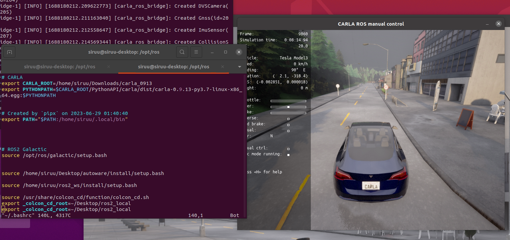

지난 포스트까지 Carla Simulator에서 Bounding Box, 차량 동역학적 물성 적용 등에 대해 알아봤습니다.  
  
이번 포스트부터는 추후 Autoware (Autoware Universe가 목표입니다. 화이팅..!) 연동을 위한 준비 과정을 진행하려 합니다.  
Carla Simulator에서 AD Stack 플랫폼 (Autoware, Apollo 등)과의 연동을 할 수 있는 ROS Bridge를 제공합니다.  

Carla ROS Bridge는 Carla Simulator를 이용한 주행 성능 평가 어플리케이션인 Carla Leaderboard에서도 사용 가능합니다.  
  
(구성도 추가)  
  
Carla Simulator와 AD Stack 연동을 더불어 직접 만든 Agent를 Carla Leaderboard를 이용하여 주행 성능 평가해보고 싶습니다. (목표 화이팅...!!)   

---
<b>23. 06. 30</b>  
ROS 2 Galactic을 이용하여 Carla Simulator와 Autoware.Universe 연동을 했습니다.  
그로 인해 ROS 2 Galactic 버전으로 작성하도록 하겠습니다.  
가상환경 없이 Ubuntu 20.04의 Python 3.8 버전을 사용하여 진행하도록 하겠습니다.
<br>
    
  
# 1. 종속 프로그램 설치
## 1.1. 작업 환경
- OS : 우분투 20.04
- 그래픽 카드 : Geforce 1660, RTX 2060
- 그래픽 드라이버 : nvidia-driver-525 (두 그래픽카드 모두 530으로 그래픽 드라이버 설치 시 제대로 호환이 되지 않았습니다.)
- 사용 ROS 버전 : ROS2 Galactic  
- 깃허브 리포지토리에서 받아 진행했습니다. 

## 1.2. 설치 프로그램
- Carla Simulator 0.9.13
- Carla Scenario Runner (0.9.13)
- ROS 2 Galactic


### 1.2.1. Carla Simulator, Scenario Runner 설치
지난 포스트 [Carla Simulator 설치](https://jswoo0615.github.io/carla_simulator/Carla-simulator/)를 참고 부탁드립니다.  

### 1.2.2. ROS2 Galactic
[ROS2 Galactic](https://docs.ros.org/en/galactic/Installation.html) 공식 사이트의 진행 순서 그대로 진행합니다.  
  
<br>    

# 2. Carla ROS Bridge 설치
## 2.1. ROS2 기반 Carla ROS Bridge
[Carla ROS Bridge 설치 홈페이지](https://carla.readthedocs.io/projects/ros-bridge/en/latest/ros_installation_ros2/)에서 <b>Install ROS Bridge for ROS 2</b>를 선택하여 다운로드 및 설치 진행합니다.  
위 홈페이지에는 <b>ROS 2 Foxy</b>를 사용을 명시하고 있습니다.  
테스트 결과 <b>ROS 2 Galactic</b>을 사용해도 무관함을 확인했습니다.  

## 2.2. 설치 시 주의사항  
Autoware Universe와 Carla Simulator 연동을 위해 Carla ROS Bridge 설치 도중 몇 가지 문제가 있었습니다.  
제가 겪었던 문제들 공유드립니다.  
  
- <h4> ackermann_msgs 등의 패키지가 없다고 에러가 발생하는 경우 </h4>
해당 에러가 발생하는 경우 수동으로 패키지를 설치해줍니다.  
`sudo apt install ros-galactic-ackermann-msgs` 등과 같은 명령어로 설치해줍니다.  
ROS 2 다른 버전을 사용하는 경우에는 `sudo apt install ros-$ROSDISTRO-ackermann-msgs`와 같이 명령어를 사용합니다.  

- <h4> derived_object_msgs 설치 </h4> 
ROS 2 Foxy는 `derived_object_msgs`는 `sudo apt install ros-foxy-ackermann-msgs`와 같이 명령어를 사용하여 수동으로 패키지 설치를 할 수 있습니다.  
하지만 ROS 2 Galactic에서는 해당 패키지 자체가 없는 문제가 있었습니다.  
해결 방법으로는 [astuff_sensor_msgs](https://github.com/astuff/astuff_sensor_msgs) 깃허브 리포지토리를 클론하여 빌드하는 방법으로 해결했습니다.  

```shell
mkdir -p ~/carla_ros_bridge_ws/src && cd ~/carla_ros_bridge_ws/src        # Carla ROS Bridge 작업공간을 만듭니다.  

# 1. carla ros bridge 리포지토리를 클론해줍니다.
git clone --recurse-submodules https://github.com/carla-simulator/ros-bridge.git src/ros-bridge

# 2. astuff_sensor_msgs 리포지토리를 클론해줍니다.
git clone https://github.com/astuff/astuff_sensor_msgs.git

# 3. 빌드해줍니다.
cd ~/carla_ros_bridge_ws    # Carla ROS Bridge 작업공간으로 이동합니다.
colcon build

# 4. 빌드 완료 후 Carla ROS Bridge를 사용하기 위해 환경변수를 등록해줍니다.
source ~/carla_ros_bridge_ws/install/setup.bash
```
  
ROS 2 Galactic 버전을 사용하였고, Carla ROS Bridge 설치 후 `ros2 launch carla_ros_bridge carla_ros_bridge_with_ego_vehicle.launch.py`로 실행했습니다.  

  

설치 / 삭제만 꽤 오랜 시간이 걸렸는데 다른 분들은 시행착오를 조금이나마 줄였으면 하는 바람입니다.  
  
참고 사이트 같이 공유드립니다.  
[To run Carla-ros-bridge with ROS Galactic_Some error fix ideas](https://github.com/carla-simulator/ros-bridge/issues/633)
 