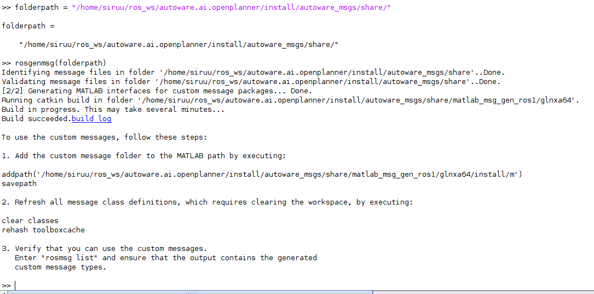
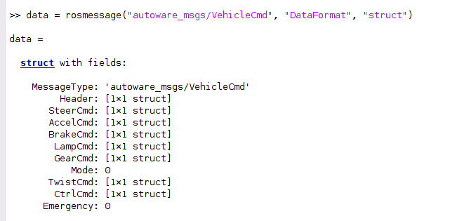
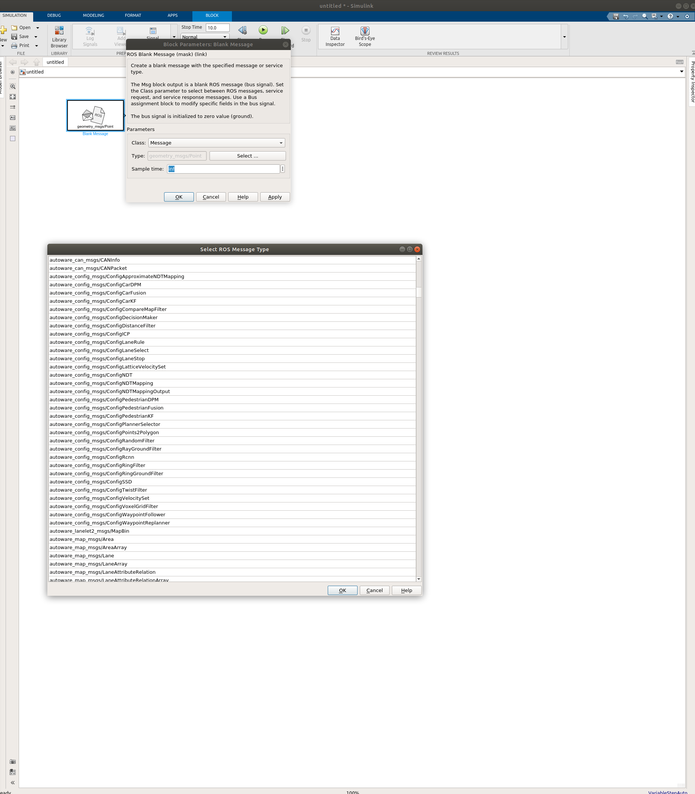
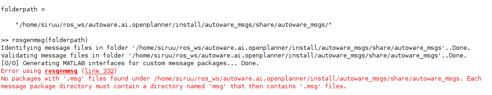
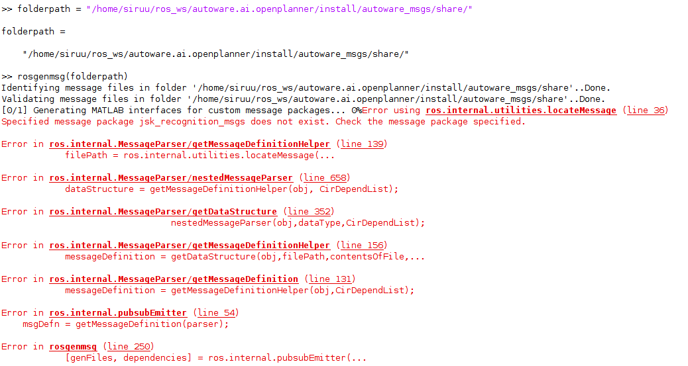
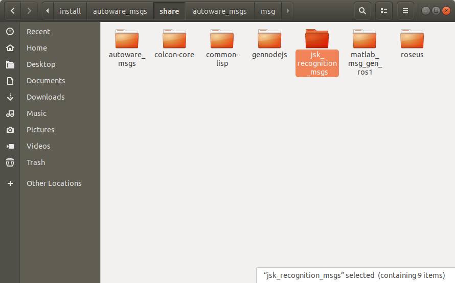

이번 포스트에서는 Matlab ROS Toolbox에 ROS 커스텀 메시지를 연동시키는 방법에 대해 적어보려합니다.  
  
# 1. ROS 사용자 지정 메시지 빌드
MATLAB ROS Toolbox에 있는 메시지 이외의 커스텀 메시지를 사용하고자 할 때 매트랩의 커맨드 창에 커스텀 메시지 경로를 지정해줍니다.  
저는 autoware의 메시지와 연동하는 것을 예시로 하겠습니다.  
`folderpath = "/home/USER/autoware.ai.openplanner/install/autoware_msgs/share"`  
  
커스텀 메시지를 MATLAB ROS Toolbox에서 사용할 수 있도록 `rosgenmsg` 명령어를 이용하여 메시지를 빌드합니다.  
`rosgenmsg(folderpath)`
  

아래 그림은 커스텀 메시지를 Matlab ROS Toolbox에 빌드하는 과정을 나타낸 그림입니다.  

# 2. 메시지 빌드 결과
빌드 후 커스텀 메시지가 제대로 빌드되었는지 확인해보겠습니다.  
매트랩 커맨드 창에 아래와 같이 입력 및 실행했습니다.  
`data = rosmesage("autoware_msgs/VehicleCmd", "DataFormat", "struct")`    
  
    
 
위 사진은 MATLAB에서 실행한 결과입니다.  
   
아래 사진으로 Simulink에 커스텀 메시지가 제대로 적용되었음을 확인할 수 있습니다.  
  
  

# 3. 발생 가능 문제
Matlab ROS Toolbox 커스텀 메시지 빌드를 하며 겪었던 문제들에 대해 해결했던 방법을 적어보려합니다.  
- <b>CMake 3.15.5</b> 이상의 버전이 설치되어 있어야 합니다.
    
- <b>경로가 잘못되었다 하는 경우</b>  
커스텀 메시지 빌드를 진행하면서 처음에는 사용하고자 하는 메시지들만 있는 폴더를 선택했었습니다.  
하지만 아래 그림과 같이 에러가 발생했습니다.  
 
빌드하고자 하는 메시지 경로를 메시지 패키지 단위로 경로를 수정 후 커스텀 메시지 빌드를 진행했습니다.  
  
- <b>jsk_recognition_msgs 누락</b>  
커스텀하고자 하는 메시지 경로 수정 후 다시 빌드를 진행하던 도중, 아래와 같은 에러가 발생했었습니다.  
  
로그를 확인하니, `jsk_recognition_msgs`가 없어서 생긴 에러였습니다.  
jsk_recongition_msgs 패키지를 다운받고 커스텀 메시지 패키지 폴더에 붙여넣습니다.   
  
  
이렇게 매트랩의 ROS Toolbox에 커스텀 메시지를 적용하는 방법에 대한 포스팅을 마치겠습니다.  