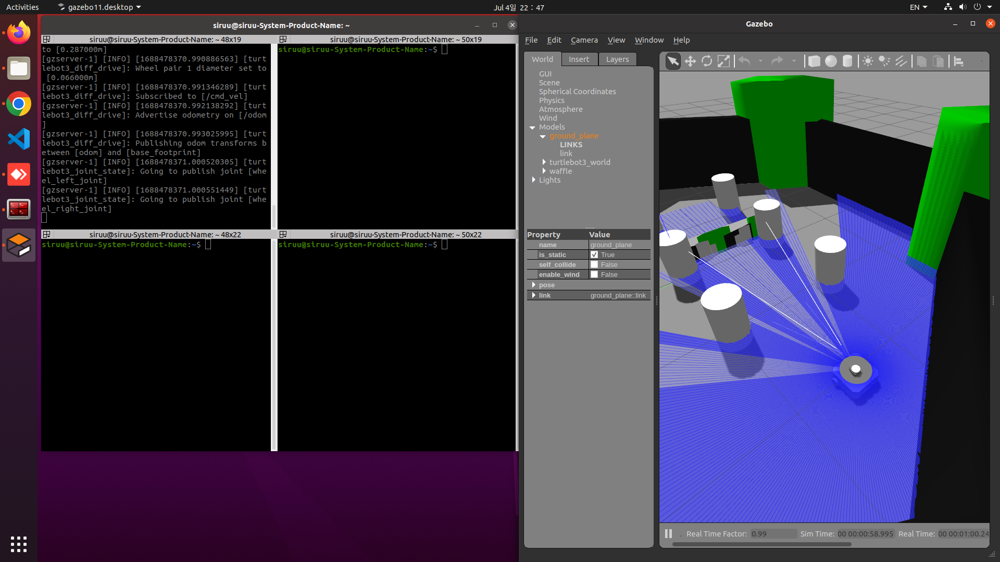
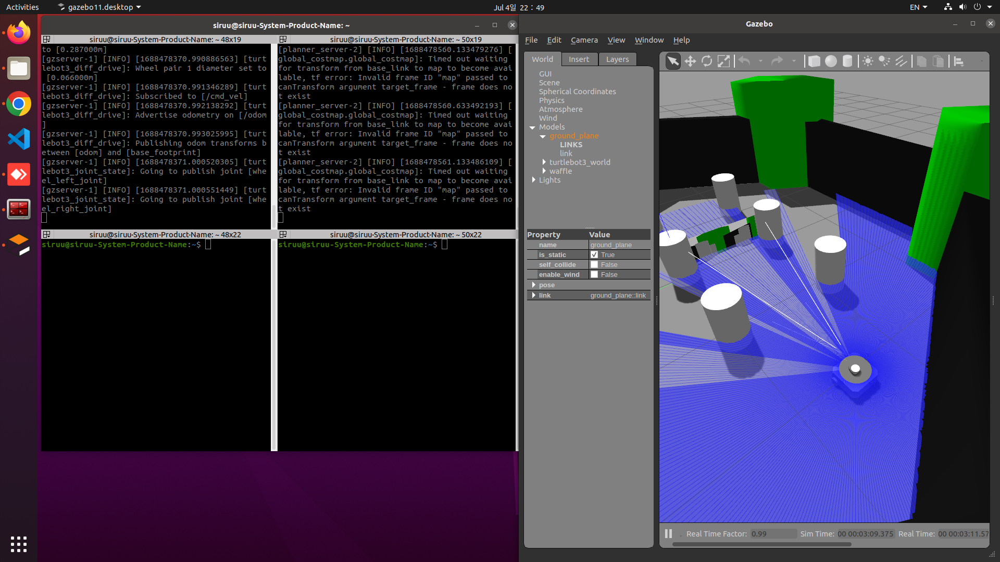
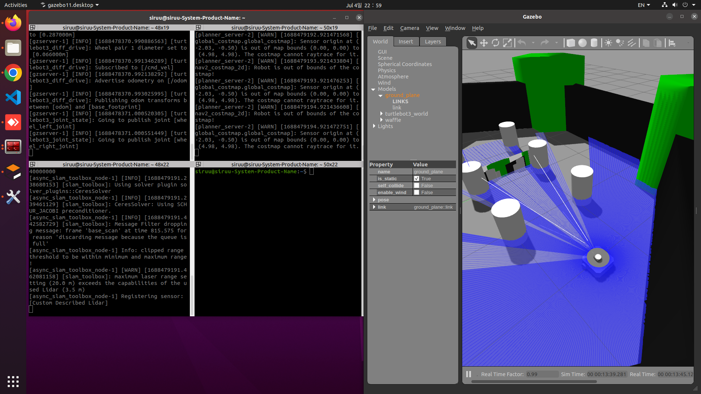
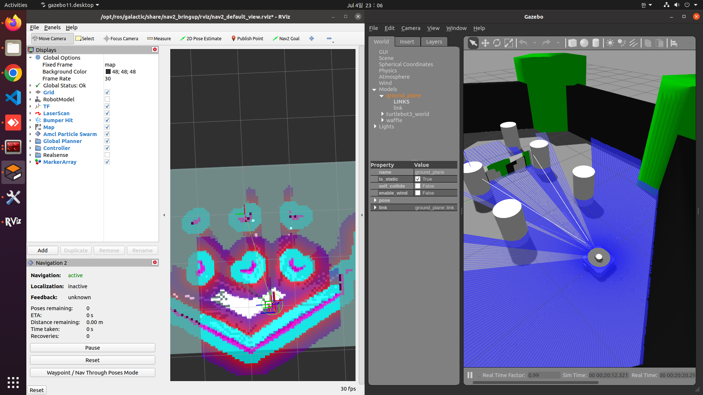
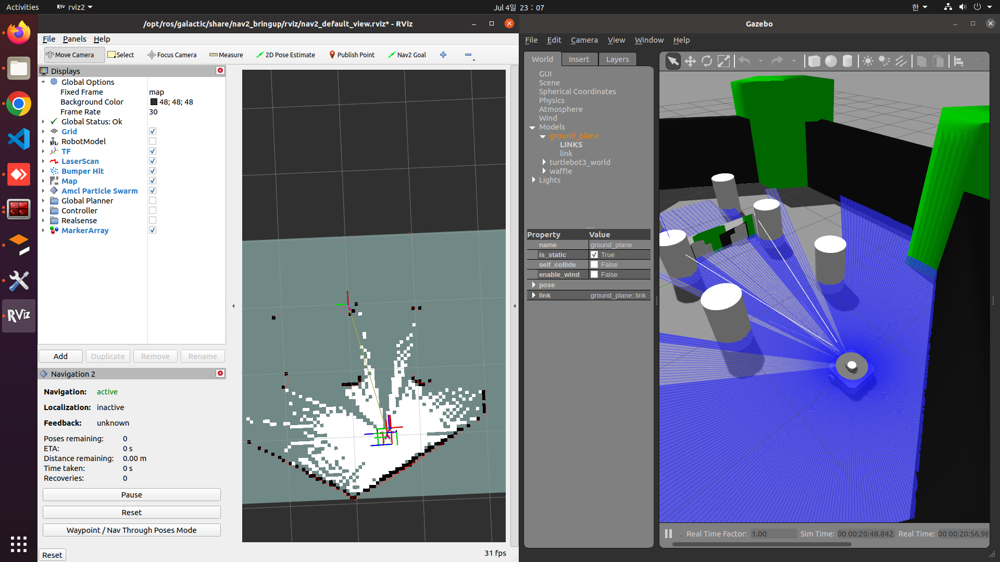
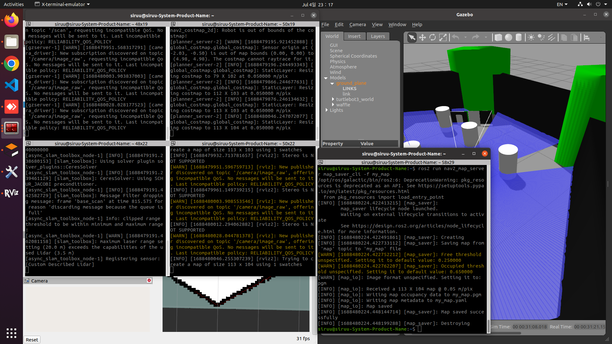
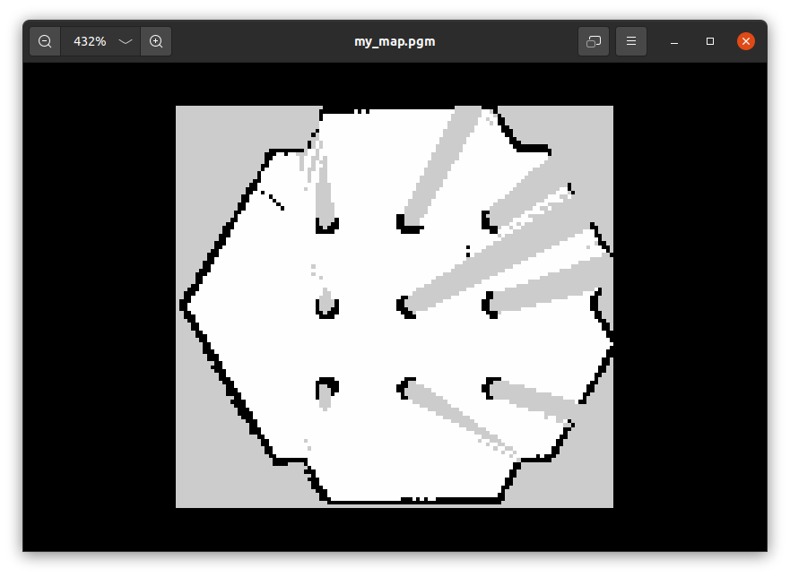

안녕하세요~ 이번 포스팅에서는 <b>Nav2</b>와 <b>Slam Toolbox</b>를 이용한 맵 생성에 대해 스터디 기록을 남기고자 합니다.  
<b>Turtlebot3</b> 패키지를 이용하여 시뮬레이션을 진행할 예정입니다.  

# 1. 패키지 설치
<b>Slam Toolbox</b>와 <b>Nav2</b> 스택을 사용하기 위해서 패키지를 설치합니다.  
저는 ROS2 Galactic 버전을 사용했습니다.  
```shell
sudo apt install ros-galactic-navigation2 ros-galactic-nav2-bringup ros-galactic-turtlebot3* ros-galactic-slam-toolbox
```

# 2. 환경설정
<b>Turtlebot3</b>를 사용하기 위해 `~/.bashrc`에 사용하고자 하는 모델을 환경변수로 추가해줍니다.  
`~/.bashrc`에 `export TURTLEBOT3_MODEL=waffle`

# 3. 실행
## 3.1. Turtlebot3 Gazebo
launch 파일을 실행하는 `ros2 launch turtlebot3_gazebo turtlebot3_world.launch.py` 명령어를 이용하여 turtlebot과 샘플 월드가 주어지는 gazebo를 실행합니다.  


## 3.2. Nav2 (Navigation Stack)
위의 [3.1. Turtlebot3 Gazebo](#31-turtlebot3-gazebo)의 Gazebo를 실행한 후 <b>Navigation 스택</b>을 실행합니다.  
`ros2 launch nav2_bringup navigation_launch.py use_sim_time:=True` 명령어를 실행하면 `Timed out waiting for transform from base_link ...`와 같은 로그를 확인하실 수 있습니다.  
이는 `target_frame`이 설정되지 않았기에 발생하는 로그입니다.  
여기서 `target_frame`은 라이다 토픽인 `/scan`이 되는 것 같습니다.  


## 3.3. Slam Toolbox
위의 [3.2. Nav2](#32-nav2-navigation-stack)에서 내비게이션 스택을 실행했습니다.  
해당 노드를 실행했지만 타겟으로 하는 프레임이 정해지지 않아 아무런 결과가 취득되지 않았습니다.  
`ros2 launch slam_toolbox online_async_launch.py use_sim_time:=True` 명령어를 이용하여 <b>Slam Toolbox</b>를 실행해줍니다.  
해당 launch 파일을 실행하면 두 번째 터미널의 출력 로그가 바뀌었음을 확인할 수 있습니다.  


## 3.4. RViz2
이제 rviz를 이용하여 라이다 센서로 스캔하는 맵의 형태를 볼 예정입니다.  
`ros2 run rviz2 rviz2 -d /opt/ros/galactic/share/nav2_bringup/rviz/nav2_default_view.rviz` 명령어를 이용하여 현재 실행된 <b>Trutlebot3 Gazebo</b>와 연동 된 rviz를 실행합니다.  
실행하면 아래 그림과 같이 현재 라이다로 스캔중인 곳을 확인할 수 있습니다.  
  
RViz의 Display 탭에서 `Global Planner`, `Controller`의 체크박스를 해제하면 아래 그림과 같이 현재 라이다 센서가 스캔중인 곳을 확인할 수 있습니다.  
  
  
이제 다른 터미널을 열어 방향키로 가상의 waffle 봇을 조종하는 turtlebot3의 teleop 패키지를 실행합니다.  
`ros2 run turtlebot3_teleop teleop_keyboard`  
w, s, d, f 키를 이용하여 waffle 봇을 조작하면 아래 영상과 같이 라이다가 스캔하며 얻어지는 공간 정보를 획득합니다.  
  
획득한 라이다 맵을 저장하기 위해서는 앞의 4개의 터미널을 실행 유지되는 상태로 다른 터미널을 열어 `ros2 run nav2_map_server map_saver_cli`를 실행합니다.  
옵션 명령어로 `-f`를 이용하여 파일 이름을 설정할 수 있습니다.  
  

저장한 맵은 아래와 같습니다.  
  
  
Carla Simulator만 사용하다가 Autoware.Universe와 연동 후 실행했을 때 Autoware.Universe 상의 차량 위치와 Carla Simulator 상의 차량 위치가 일치하지 않는 문제가 있었습니다.  
(아직 해결중입니다)  
문제점이 무엇인지부터 알아가다보니 Localization 문제인 것 같아 스터디를 하며 해결중에 있습니다.  
하나하나 알아가는 재미가 있어서 매우 좋습니다.  