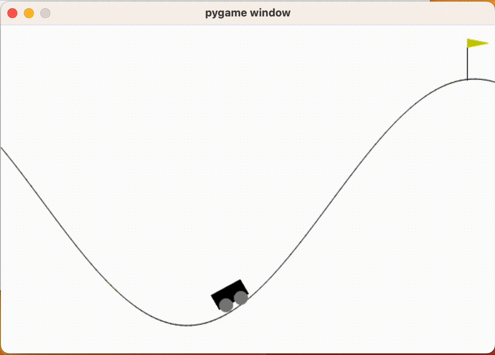

안녕하세요, 이번 포스트부터는 Carla Simulator에서도 강화학습이 가능하다는 이야기를 듣고 모델 구성을 위해 개념을 잡아보는 시간으로 이번 포스팅을 하게 되었습니다.  

강화학습 개념을 잡기 위해 OpenAI의 gym을 이용하여 개념을 잡아보고자 합니다.  

# 0. 설치
```shell
pip install gym
```
위 명령어를 실행하여 gym을 설치해줍니다.  
# 1. 환경 설정
```python
import gym
```
gym을 불러옵니다.  
사용하고자 하는 강화학습 환경은 CartPole, CarRacing, LunarLander 등의 다양한 환경을 사용할 수 있습니다.  
`env = gym.make("MountainCar-v0")`과 같이 사용하고자 하는 환경을 초기화해줍니다.  
`env`에 속한 사용 가능한 `action`의 갯수는 `print(env.action_space.n)`으로 확인할 수 있습니다.  
```python
env = gym.make("MountainCar-v0")
print(env.action_space.n)
```
위의 코드로 되어있는 파이썬 파일을 실행하면 3이라는 결과를 확인하실 수 있습니다.  
이는 진행방향 왼쪽으로 이동 (0), 유지 (1), 오른쪽으로 이동 (2)을 의미합니다.  
강화학습을 진행할 때마다 `env`는 new_state, reward, 해당 환경의 완료 상태 (done) 등을 반환합니다.  
모델은 0, 1, 2에 대한 정보와 reward에 대해서만 정보를 알게되고, 학습을 수행합니다.  

`reset()` 메소드를 이용하여 환경을 초기화합니다.  
`env.reset()`의 값을 출력하면 초기 위치가 반환됩니다.
```shell
(array([-0.53320926,  0,        ], dtype=float32), {})
```

아래 코드는 `MountainCar-v0` 모델을 사용하여 왼쪽으로만 이동하는 경우입니다.  
`done`은 모델이 이번 iteration 목표치에 도달하지 못했으므로, 다음 iteration으로 진행할지 말지에 대한 여부 판단을 하는 역할을 하는 변수입니다.  
현재는 완료되지 않은 상태로 설정했습니다.  
다음 iteration으로 진행할 때 왼쪽으로만 이동하도록 했습니다.
```python
while not done:
  action = 2
  env.step(action)
  env.render()
```
주의사항으로는 gym 버전이 업데이트 됨에 따라 가시화를 위해 `gym.make("Model NAME", render_mode="human 또는 rgb_array 등")`의 옵션을 추가해주어야 합니다.  

```python
import gym

env = gym.make("MountainCar-v0", render_mode="human")
env.reset()

done = False

while not done:
  action = 2
  env.step(action)
  env.render()
```
위 코드의 결과는 아래 그림과 같습니다.  


## 3. step 함수
위에서 reward 없이 한 방향으로만 움직이는 것을 확인했습니다.  
step 함수를 추가하여 업데이트 된 카트의 위치, 보상, 목표치 도달 여부를 확인하도록 하겠습니다.  
```python
  new_state, reward, done, info, _ = env.step(action)
```
각 스텝마다 new_state, reward를 얻습니다.  
```python
new state :  [-0.34594882  0.00170417]
reward :  -1.0
done :  False
new state :  [-0.34451485  0.00143398]
reward :  -1.0
done :  False
new state :  [-0.3433603   0.00115454]
reward :  -1.0
done :  False
new state :  [-0.34249264  0.00086766]
reward :  -1.0
done :  False
```
현재 카트의 새로운 위치 및 보상 등이 업데이트 됨을 확인할 수 있습니다.